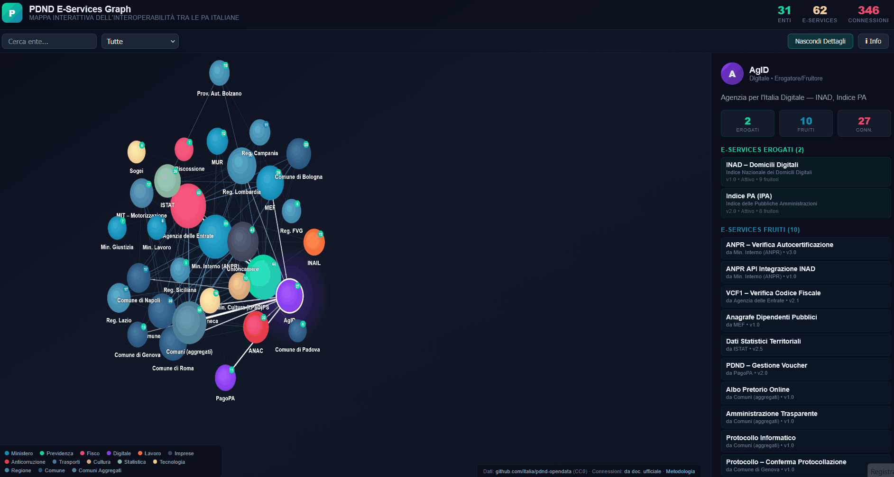
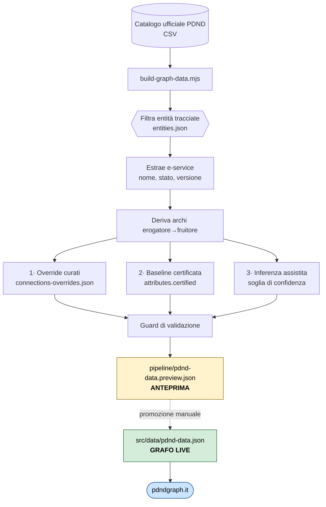

<div align="center">

# PDND E-Services Graph

**La rete dell'interoperabilità italiana, resa navigabile.**

Visualizzazione interattiva del grafo degli e-service sulla Piattaforma Digitale Nazionale Dati.<br>
I nodi sono gli enti, gli archi le relazioni erogatore→fruitore, lo spessore il numero di servizi condivisi.

[](https://www.pdndgraph.it)
[](https://doi.org/10.5281/zenodo.19989954)

[](https://www.gnu.org/licenses/agpl-3.0)
[](https://github.com/engineering87/pdnd-eservices-graph/issues)


[](https://github.com/engineering87/pdnd-eservices-graph)



<sub>Applicazione pubblica su **[pdndgraph.it](https://www.pdndgraph.it)**, senza installazione né autenticazione.</sub>

</div>

---

<div align="center">

**51** nodi (50 enti individuali + 1 aggregato) &nbsp;·&nbsp; **86** tipi di e-service &nbsp;·&nbsp; **343** archi &nbsp;·&nbsp; densità **0,1345** &nbsp;·&nbsp; copertura **~89%** del catalogo

<sub>I nodi sono una selezione editoriale, non l'intero insieme degli enti aderenti. Vedi [Cosa rappresentano i 51 nodi](#cosa-rappresentano-i-51-nodi).</sub>

</div>

---

> [!IMPORTANT]
> **La PDND è un ecosistema dinamico.** Enti aderenti, e-service pubblicati, e connessioni attive cambiano di continuo. Questo grafo è una **fotografia datata**, non uno specchio in tempo reale della piattaforma.
>
> | | Riferimento |
> |---|---|
> | Snapshot del grafo pubblicato | **2 maggio 2026** |
> | Ultima esecuzione della pipeline | 19 giugno 2026, anteprima non promossa |
> | Numeri PDND in tempo reale | [interop.pagopa.it/numeri](https://www.interop.pagopa.it/numeri) |
> | Catalogo ufficiale e-service | [api.gov.it](https://api.gov.it) |
>
> Per l'ordine di grandezza dello scarto: lo snapshot di maggio registra 14.102 API pubblicate, mentre il download della pipeline del 19 giugno riporta 15.011 righe di catalogo. Chi cita numeri tratti da questo progetto dovrebbe indicare sempre la data dello snapshot. Confronto aggiornato con `npm run compare-catalog`.

## Indice

**Capire** &nbsp;·&nbsp; [Perché questo progetto](#perché-questo-progetto) &nbsp;·&nbsp; [Stato dei dati](#stato-dei-dati-e-aggiornamento) &nbsp;·&nbsp; [Il modello in numeri](#il-modello-in-numeri) &nbsp;·&nbsp; [Perché un grafo](#perché-un-grafo) &nbsp;·&nbsp; [Cosa emerge dal grafo](#cosa-emerge-dal-grafo)

**Fidarsi** &nbsp;·&nbsp; [Fonti e trasparenza metodologica](#fonti-dati-e-trasparenza-metodologica) &nbsp;·&nbsp; [Pubblicazione di riferimento](#pubblicazione-di-riferimento) &nbsp;·&nbsp; [Come citare](#come-citare)

**Usare** &nbsp;·&nbsp; [Funzionalità](#funzionalità) &nbsp;·&nbsp; [Quick Start](#quick-start) &nbsp;·&nbsp; [Struttura del progetto](#struttura-del-progetto) &nbsp;·&nbsp; [Tecnologie](#tecnologie)

**Estendere** &nbsp;·&nbsp; [Pipeline di aggiornamento](#pipeline-di-aggiornamento) &nbsp;·&nbsp; [Come aggiornare i dati](#come-aggiornare-i-dati) &nbsp;·&nbsp; [Contribuire](#contribuire) &nbsp;·&nbsp; [Licenza](#licenza)

## Perché questo progetto

La PDND è il pilastro dell'interoperabilità tra le Pubbliche Amministrazioni italiane: consente lo scambio sicuro e standardizzato di dati tramite API, realizzando concretamente il principio *once-only*, la PA non chiede a cittadini e imprese dati che già possiede.

L'ecosistema è vasto e in rapida crescita. Lo snapshot del catalogo ufficiale registrato in questo repository (maggio 2026) conta **14.102 API pubblicate**, 366 sospese, e **6.388 producer distinti**. I numeri aggiornati in tempo reale sono pubblicati da PagoPA su [interop.pagopa.it/numeri](https://www.interop.pagopa.it/numeri), e il catalogo pubblico degli e-service è consultabile su [api.gov.it](https://api.gov.it).

Questa scala rende difficile avere una visione d'insieme: chi eroga quali servizi? Chi li fruisce? Quanto è interconnessa la rete dell'interoperabilità italiana?

Il progetto nasce per rendere **visibile e navigabile** quella rete. L'obiettivo è offrire una mappa interattiva che permetta a chiunque, funzionari pubblici, sviluppatori, ricercatori, cittadini, di esplorare le connessioni tra gli enti e comprendere come i dati fluiscono attraverso la Pubblica Amministrazione.

Nei fatti, i dataset open data della PDND pubblicano il **catalogo degli e-service** e il **numero aggregato** delle connessioni, ma non le **coppie puntuali** erogatore–fruitore. Le relazioni rappresentate in questo grafo sono state ricostruite da documentazione ufficiale pubblica (circolari, manuali operativi, presentazioni istituzionali) e dal campo `attributes` del catalogo. Questo progetto vuole anche essere uno stimolo affinché quei dati diventino un giorno completamente aperti.

## Stato dei dati e aggiornamento

La PDND non è un archivio statico. Il catalogo cresce con l'adesione di nuovi enti e con la pubblicazione di nuovi e-service, gli stati passano da Attivo a Sospeso e viceversa, e le versioni delle API si succedono. Ogni rappresentazione del grafo è quindi valida rispetto a un istante preciso, e va letta con la sua data accanto.

### Come si articola il ciclo di aggiornamento

Il progetto mantiene due livelli distinti, per separare l'automazione dal dato pubblicato.

| Livello | File | Aggiornato al | Contenuto |
|---|---|---|---|
| **Grafo live** (curato) | `src/data/pdnd-data.json` | **2 maggio 2026** | 51 nodi, 86 tipi di e-service, 343 archi |
| **Anteprima** (automatica) | `pipeline/pdnd-data.preview.json` | 19 giugno 2026 | 54 enti, 218 e-service, non promossa |

L'anteprima viene rigenerata dalla pipeline mensile ma **non sostituisce** il grafo live: la promozione è un atto manuale, deliberato, che segue l'ispezione del report di esecuzione. Questa separazione evita che un cambiamento automatico del catalogo cancelli relazioni ricostruite e documentate a mano.

### Verificare lo scarto rispetto al presente

```bash
npm run compare-catalog   # copertura e gap del modello rispetto al catalogo vivo
cat pipeline/last-run-report.md   # report dell'ultima esecuzione della pipeline
```

Il report di esecuzione riporta la data, il numero di righe scaricate dal catalogo, i nuovi e-service, quelli rimossi, e la ripartizione degli archi per provenienza (documentata, certificata, inferita).

### Nota per chi cita questo progetto

I numeri riportati in questo README e nel report Zenodo si riferiscono allo snapshot di maggio 2026. Non vanno presentati come lo stato corrente della PDND. Per i valori aggiornati in tempo reale, la fonte autoritativa è [interop.pagopa.it/numeri](https://www.interop.pagopa.it/numeri).

## Il modello in numeri

Valori calcolati su `src/data/pdnd-data.json` allo snapshot del **2 maggio 2026**, riproducibili con `npm run audit`.

| Metrica | Valore |
|---|---|
| Nodi nel grafo | **51** (50 individuali + 1 aggregato) |
| Tipi di e-service | **86** |
| Archi distinti erogatore→fruitore | **343** |
| Relazioni erogatore–fruitore totali | 570 |
| Densità del grafo | 0,1345 |
| Copertura del catalogo ufficiale | ~89% di 14.102 endpoint |
| Snapshot del catalogo | maggio 2026 |

Composizione dei nodi per ruolo: 31 Erogatore/Fruitore, 17 Erogatore, 3 Fruitore.

Composizione per categoria: 21 Regione, 7 Ministero, 6 Comune, 3 Fisco, 2 Digitale, 2 Trasporti, 2 Tecnologia, 2 Statistica, 1 Previdenza, 1 Lavoro, 1 Imprese, 1 Anticorruzione, 1 Cultura, 1 Comuni Aggregati.

### Cosa rappresentano i 51 nodi

> [!IMPORTANT]
> **51 non è il numero degli enti aderenti alla PDND.** È il numero dei nodi di un modello che aggrega e seleziona deliberatamente. Leggere 51 come "51 enti su migliaia" è un fraintendimento del modello.

I 51 nodi si compongono così:

| | Cosa contiene |
|---|---|
| **50 nodi individuali** | Enti rappresentati uno a uno: ministeri, enti previdenziali e fiscali, autorità, 21 Regioni, e 6 grandi Comuni |
| **1 nodo aggregato** (`comuni_agg`) | Circa **7.500 Comuni aderenti**, compressi in un solo nodo perché erogano gli stessi servizi standard replicati |

Due scelte editoriali determinano questo insieme.

**Aggregazione.** La maggior parte degli endpoint del catalogo sono servizi comunali standard replicati da ogni Comune: Albo Pretorio, SUAP, Protocollo, Demografici, Tributi, Civici, WaaS, IoT, Trasparenza. Rappresentarli uno per uno produrrebbe migliaia di nodi quasi identici e un grafo illeggibile, senza aggiungere informazione sulla struttura della rete. I 9 e-service attribuiti al nodo aggregato corrispondono a circa 6.380 endpoint reali del catalogo.

**Selezione.** Lo snapshot del catalogo conta 6.388 producer distinti. Il modello ne rappresenta individualmente 50, scelti per rilevanza nella rete: gli hub erogatori nazionali, gli enti con ruolo strutturale nei domini funzionali della PA, le Regioni che superano i 25 endpoint a catalogo, e i Comuni che erogano servizi propri e non solo repliche standard. Bologna, Genova, e Padova compaiono come erogatori di servizi specifici; Milano, Roma, e Napoli come fruitori.

La conseguenza pratica riguarda l'interpretazione delle metriche. Grado, centralità, e densità sono calcolati **su questo insieme selezionato**, non sull'universo degli aderenti. Un grado in uscita di 34 significa "eroga verso 34 dei 50 altri nodi del modello", dove uno di quei nodi ne rappresenta a sua volta migliaia. Sono indicatori della struttura della rete rappresentata, non censimenti dell'ecosistema. I criteri completi sono in [METODOLOGIA.md §3.1](METODOLOGIA.md#31-aggregazione-dei-comuni) e [§3.2](METODOLOGIA.md#32-selezione-degli-enti-rappresentati).

> [!NOTE]
> Analogamente, ogni record in `eservices` rappresenta un **tipo di servizio**, non un singolo endpoint del catalogo PDND. Vedi [METODOLOGIA.md §3.5](METODOLOGIA.md#35-tipi-di-servizio-service-type-vs-endpoint-del-catalogo).

## Perché un grafo

L'interoperabilità è, nella sua essenza, un problema di rete: soggetti che producono dati e soggetti che li consumano, collegati da accordi e interfacce digitali. Un elenco tabulare risponde alla domanda "quali servizi esistono". Un grafo risponde a "che forma ha la rete che ne risulta", che è la domanda interessante.

Il modello è un **grafo diretto pesato**: i nodi sono gli enti, un arco da A a B indica che A eroga almeno un e-service fruito da B, e il peso conta i servizi condivisi sulla coppia. La direzione conta, perché la relazione non è simmetrica: il fatto che INPS eroghi verso i Comuni non implica il contrario.

La visualizzazione usa un layout force-directed (Fruchterman-Reingold), che dispone i nodi come un sistema di molle e repulsioni fino all'equilibrio: la topologia emerge da sola, senza posizionamento manuale. Le formule di grado, centralità, e densità sono in [METODOLOGIA.md](METODOLOGIA.md).

## Cosa emerge dal grafo

Alcune proprietà della rete diventano leggibili a colpo d'occhio. I valori seguenti sono calcolati sullo snapshot del 2 maggio 2026 e riproducibili con `npm run audit`. Vanno letti sul modello, non sull'universo degli aderenti: vedi [Cosa rappresentano i 51 nodi](#cosa-rappresentano-i-51-nodi).

**La rete è fortemente asimmetrica.** ANPR eroga verso 34 dei 50 altri nodi del modello e ne fruisce solo da 5. È il profilo puro dell'hub erogatore. All'estremo opposto, Comune di Milano e Comune di Roma compaiono con grado in uscita zero: fruiscono soltanto.

**Pochi nodi reggono un quarto della rete.** I primi tre erogatori concentrano il 24,5% dei 343 archi totali. La densità del grafo è 0,1345, circa un ottavo delle connessioni teoricamente possibili tra i nodi rappresentati, coerente con un'interoperabilità ancora incardinata su pochi snodi centrali.

**Alcuni enti sono cerniere, non estremità.** INPS eroga verso 33 nodi e fruisce da 34: sta contemporaneamente al centro del welfare come fonte e come consumatore. Il nodo aggregato dei Comuni mostra il pattern complementare, con 37 archi in ingresso e 14 in uscita, coerente con la sua natura di collettore di migliaia di enti fruitori.

**I cluster tematici corrispondono ai domini della PA.** Welfare (INPS, Comuni, Ministero del Lavoro), fisco (Agenzia delle Entrate, MEF, Sogei), trasparenza (ANAC, AgID) si separano spontaneamente nel layout, senza che nessuna categoria sia stata usata per posizionarli.

La lettura pratica è diretta. I nodi ad alta centralità sono i punti la cui indisponibilità propagherebbe l'impatto su molti altri enti, e una densità crescente nel tempo sarebbe il segnale che l'interoperabilità italiana si sta effettivamente distribuendo, invece di concentrarsi.

## Funzionalità

- **Grafo force-directed** interattivo con simulazione fisica
- **51 nodi** (50 enti individuali più 1 nodo che aggrega circa 7.500 Comuni) e **86 tipi di e-service** derivati dal catalogo ufficiale PDND
- **343 archi** diretti erogatore→fruitore
- **Drag & drop** dei nodi, **zoom** con scroll, **pan** con trascinamento
- **Pannello dettagli** con elenco e-services erogati e fruiti per ogni ente
- **Filtro per categoria** (cliccabile dalla legenda) e **ricerca testuale**
- **Frecce direzionali** erogatore → fruitore
- **Badge numerici** con conteggio connessioni
- **Colori per categoria**: Ministero, Regione, Previdenza, Fisco, Digitale, ecc.
- **Servizi comunali aggregati**: i Comuni minori sono rappresentati come nodo unico

## Fonti dati e trasparenza metodologica

| Dato | Fonte ufficiale | Natura |
|---|---|---|
| Enti (nodi) | [`aderenti.csv`](https://github.com/italia/pdnd-opendata), dati.gov.it | ✅ Dato aperto ufficiale |
| E-service | [`eservice_a_catalogo.csv`](https://github.com/italia/pdnd-opendata), dati.gov.it | ✅ Dato aperto ufficiale |
| Connessioni (archi) | Campo `attributes.certified`, circolari, manuali operativi | ⚠️ Ricostruzione documentata |

> [!CAUTION]
> **Le connessioni non sono un dato aperto.** Enti ed e-service provengono dai dataset open data ufficiali della PDND. Le relazioni erogatore→fruitore sono ricostruite dal campo `attributes.certified` del catalogo e da documentazione ufficiale pubblica: circolari ANPR DAIT n. 73/2023 e n. 61/2025, presentazione ANCI/DTD sui 26 casi d'uso, manuale operativo SSU Unioncamere, documentazione I.PaC, approfondimenti tecnici specializzati. Il dato puntuale delle connessioni attive non è al momento pubblicato come dato aperto strutturato. Dettagli in **[METODOLOGIA.md](METODOLOGIA.md)**.

> [!NOTE]
> **Aggregazione dei Comuni.** La maggior parte degli endpoint del catalogo sono servizi standard replicati da ciascun Comune aderente (Albo Pretorio, SUAP, Protocollo, Demografici, Tributi, Civici, WaaS, IoT, Trasparenza). Per rendere il grafo leggibile, i Comuni minori confluiscono in un **unico nodo aggregato** (`comuni_agg`), mentre 6 grandi Comuni restano individuali: Bologna, Genova, e Padova erogano servizi specifici, Milano, Roma, e Napoli compaiono come fruitori. Le Regioni sono rappresentate individualmente quando superano i 25 endpoint nel catalogo. Vedi [METODOLOGIA.md §3.1](METODOLOGIA.md#31-aggregazione-dei-comuni).

📄 **Documentazione completa:** [METODOLOGIA.md](METODOLOGIA.md)

## Pubblicazione di riferimento

La metodologia adottata in questo progetto è documentata nel report tecnico:

> Del Re, F. (2026). *The PDND E-Service Network: A Graph-Based Model from Italian Open Government Data*. Zenodo, v1.0.0, 3 maggio 2026. [doi:10.5281/zenodo.19989954](https://doi.org/10.5281/zenodo.19989954)

Il report descrive il modello, le fonti, la pipeline di ricostruzione, il ruolo dei modelli linguistici come strumento di estrazione, e riporta la copertura misurata del modello rispetto al catalogo PDND ufficiale (~89% di 14.102 endpoint pubblicati). Distribuito con licenza CC-BY-4.0. Il sorgente LaTeX è in [pdnd-graph-paper](https://github.com/engineering87/pdnd-graph-paper).

## Quick Start

```bash
# Clona il repository
git clone https://github.com/engineering87/pdnd-eservices-graph.git
cd pdnd-eservices-graph

# Installa le dipendenze
npm install

# Avvia in sviluppo
npm run dev
```

L'app sarà disponibile su `http://localhost:3000`.

## Struttura del progetto

```
pdnd-eservices-graph/
├── .github/workflows/
│   ├── azure-static-web-apps-polite-plant-07967ad10.yml  # CI/CD per Azure
│   └── update-graph-data.yml                             # Pipeline dati mensile
├── docs/
│   └── demo.gif
├── pipeline/                            # ← Aggiornamento automatico del catalogo
│   ├── build-graph-data.mjs             # Script di build del grafo
│   ├── entities.json                    # Registro entità tracciate (codici IPA)
│   ├── category-map.json                # Mappa attributes.certified → nodi
│   ├── connections-overrides.json       # Connessioni curate da documentazione
│   ├── pdnd-data.preview.json           # Anteprima generata (NON è il dato live)
│   ├── last-run-report.md               # Report dell'ultima esecuzione
│   └── README.md
├── public/
│   └── favicon.svg
├── scripts/
│   ├── update-data.mjs                  # Riepilogo del catalogo PDND
│   ├── audit-model.mjs                  # Audit interno del modello
│   ├── compare-catalog.mjs              # Confronto modello vs catalogo
│   ├── compute-paper-metrics.mjs        # Snippet per il report Zenodo
│   └── README.md
├── src/
│   ├── components/
│   │   └── PDNDGraph.jsx                # Componente principale del grafo
│   ├── data/
│   │   └── pdnd-data.json               # ← DATI LIVE: modifica questo file
│   ├── App.jsx
│   ├── index.css
│   └── main.jsx
├── index.html
├── package.json
├── staticwebapp.config.json             # Config Azure Static Web Apps
├── vite.config.js
├── METODOLOGIA.md                       # ← Fonti, metodologia, limitazioni
└── README.md
```

## Pipeline di aggiornamento

La cartella `pipeline/` contiene l'automazione che mantiene il grafo allineato allo stato corrente del catalogo PDND, eseguita mensilmente da GitHub Actions.



L'override documentato ha precedenza sulla baseline certificata, che a sua volta ha precedenza sull'inferenza. La GitHub Action mensile committa l'anteprima su `main`.

> [!WARNING]
> **Modalità non distruttiva.** La pipeline **non** sovrascrive il grafo curato `src/data/pdnd-data.json`. Scrive sempre sull'anteprima `pipeline/pdnd-data.preview.json`. Il grafo mostrato dall'app resta quello curato finché l'anteprima non viene promossa manualmente. L'automazione può quindi girare senza rompere le relazioni documentate esistenti.

### Uso manuale

```bash
# Dry-run: scarica, calcola, stampa il report. Non scrive nulla.
node pipeline/build-graph-data.mjs

# Aggiorna l'ANTEPRIMA. Il grafo live resta intatto.
node pipeline/build-graph-data.mjs --write

# Solo archi certificati e documentati, senza inferenza
node pipeline/build-graph-data.mjs --no-ai
```

### Inferenza assistita

La derivazione degli archi per gli e-service non coperti da override documentati può usare un motore di inferenza LLM, con vincoli progettati per la riproducibilità:

- **Vocabolario controllato**: il modello seleziona i fruitori solo tra i nodi esistenti, non può introdurre entità nuove
- **Soglia di confidenza**: gli archi sotto `INFERENCE_MIN_CONF` (default 0,55) vengono scartati
- **Cache per `catalogId`**: un e-service già inferito non viene rielaborato, quindi il grafo resta stabile tra le esecuzioni
- **Fail-safe**: se la chiave manca o l'API non risponde, la pipeline prosegue con i soli archi certificati e documentati
- **Determinismo**: temperatura 0

Configurazione tramite le variabili `INFERENCE_ENGINE` (`anthropic` o `github`), `ANTHROPIC_API_KEY`, `ANTHROPIC_MODEL`, `GITHUB_MODEL`, `INFERENCE_MIN_CONF`, `INFERENCE_MAX_CALLS`, `INFERENCE_DELAY_MS`, e `INFERENCE_MAX_RETRIES`. Dettagli in [pipeline/README.md](pipeline/README.md).

### Provenienza degli archi

Ogni arco generato dalla pipeline porta un campo `origine` che ne dichiara la fonte, così che la natura del dato resti leggibile a valle:

| Origine | Significato |
|---|---|
| `documentata` | Override da fonti ufficiali pubbliche (circolari, manuali, presentazioni) |
| `certificata` | Derivata dal campo `attributes.certified` del catalogo |
| `inferita` | Stima prodotta dal motore di inferenza, con punteggio di confidenza |

Gli archi inferiti sono dichiarati come stime e non come fatti documentati. Il progetto si basa esclusivamente su informazioni già pubbliche.

## Come aggiornare i dati

### Aggiungere un nuovo ente

Apri `src/data/pdnd-data.json` e aggiungi un oggetto all'array `enti`:

```json
{
  "id": "nuovo_ente",
  "name": "Nome Visibile",
  "tipo": "Erogatore | Fruitore | Erogatore/Fruitore",
  "categoria": "Ministero",
  "descrizione": "Descrizione estesa dell'ente"
}
```

Se la categoria è nuova, aggiungi il colore in `CATEGORY_COLORS` dentro `src/components/PDNDGraph.jsx`.

### Aggiungere un nuovo e-service

Aggiungi un oggetto all'array `eservices`:

```json
{
  "id": "es_nuovo",
  "nome": "Nome del Servizio",
  "erogatore": "id_ente_erogatore",
  "fruitori": ["id_fruitore_1", "id_fruitore_2"],
  "versione": "1.0",
  "stato": "Attivo",
  "descrizione": "Cosa fa questo e-service"
}
```

Ricorda che un record rappresenta un **tipo di servizio**, non un singolo endpoint del catalogo.

### Verificare il catalogo ufficiale

Lo script `update-data` scarica il CSV grezzo dal repository ufficiale e mostra statistiche utili per scoprire nuovi erogatori o servizi da aggiungere:

```bash
npm run update-data
```

I valori dipendono dallo stato corrente del catalogo. Lo snapshot di riferimento registrato nel modello (maggio 2026) riporta 14.102 API pubblicate, 366 sospese, e 6.388 producer distinti.

### Auditare il modello e generare metriche

Tre script complementari verificano in modo ripetibile la coerenza del modello e generano i numeri esatti dei deliverable scientifici:

```bash
npm run audit             # audit interno del JSON: conteggi, gradi, consistency checks
npm run compare-catalog   # confronto con il catalogo ufficiale, copertura, gap
npm run paper-metrics     # snippet pgfplots/LaTeX per il report Zenodo
```

`npm run audit` segnala incoerenze (ad esempio un nodo dichiarato `Erogatore` ma senza e-service erogati). `npm run compare-catalog` calcola la copertura percentuale del modello rispetto al catalogo PDND vivo. Per dettagli vedi [scripts/README.md](scripts/README.md).

## Tecnologie

- **React 19**, UI
- **Vite 8**, build tool
- **Canvas 2D**, rendering del grafo senza dipendenze esterne
- **Azure Static Web Apps**, hosting
- **GitHub Actions**, CI/CD e pipeline dati mensile

## Contribuire

Le Pull Request sono benvenute. Per contribuire:

1. Fai un fork del repository
2. Crea un branch (`git checkout -b feature/nuovo-ente`)
3. Modifica `src/data/pdnd-data.json` o il componente
4. Esegui `npm run audit` per verificare la coerenza del modello
5. Committa e pusha (`git push origin feature/nuovo-ente`)
6. Apri una Pull Request

Le correzioni alle relazioni erogatore→fruitore sono particolarmente utili quando accompagnate dal riferimento alla fonte pubblica che le documenta.

## Come citare

Se questo progetto ti è stato utile in una pubblicazione, una presentazione, un report, o un altro lavoro derivato, la citazione di riferimento è il report tecnico:

> Del Re, F. (2026). *The PDND E-Service Network: A Graph-Based Model from Italian Open Government Data*. Zenodo. https://doi.org/10.5281/zenodo.19989954

```bibtex
@techreport{delre2026pdnd,
  author      = {Del Re, Francesco},
  title       = {The {PDND} E-Service Network: A Graph-Based Model from
                 Italian Open Government Data},
  institution = {Zenodo},
  year        = {2026},
  month       = {5},
  doi         = {10.5281/zenodo.19989954},
  url         = {https://doi.org/10.5281/zenodo.19989954},
  version     = {1.0.0}
}
```

GitHub espone la citazione anche dal pulsante **Cite this repository** nella barra laterale, generato da [`CITATION.cff`](CITATION.cff).

> [!NOTE]
> **Cosa è dovuto e cosa è richiesto.** Il report su Zenodo è distribuito sotto **CC-BY-4.0**, quindi il suo riutilizzo richiede l'attribuzione. Il codice è sotto **AGPL-3.0**, che impone di conservare le note di copyright e di licenza e di rilasciare le opere derivate sotto la stessa licenza, ma non contiene un obbligo di citazione in senso accademico. La citazione del report resta quindi una richiesta, non un vincolo di licenza sul codice. Se usi il progetto in un contesto scientifico o istituzionale, citarlo è il modo corretto di rendere tracciabile la provenienza del modello, e permette a chi legge di risalire alla metodologia e ai suoi limiti dichiarati.

## Licenza

Questo progetto è distribuito sotto licenza **AGPL-3.0**, vedi [LICENSE](LICENSE).

### Cosa significa in pratica

- Puoi **usare, modificare e distribuire** liberamente il codice
- Se **modifichi il codice e lo distribuisci**, devi rendere disponibili le modifiche sotto la stessa licenza
- Se **usi questo software come servizio (es. web app accessibile da utenti)**, sei tenuto a rendere disponibile il codice sorgente modificato agli utenti del servizio

### Nota importante per l'uso in produzione

Se utilizzi questo progetto (o una sua derivazione) per erogare un servizio accessibile via rete, la licenza AGPL richiede che:

- gli utenti possano accedere al codice sorgente della versione in esecuzione
- eventuali modifiche apportate siano pubblicate

### Dati

I dati sugli e-services provengono da [PDND Open Data](https://github.com/italia/pdnd-opendata) e sono distribuiti sotto licenza **CC0 1.0 Universal** (Pubblico Dominio) dalla Presidenza del Consiglio dei Ministri – Dipartimento per la Trasformazione Digitale.
